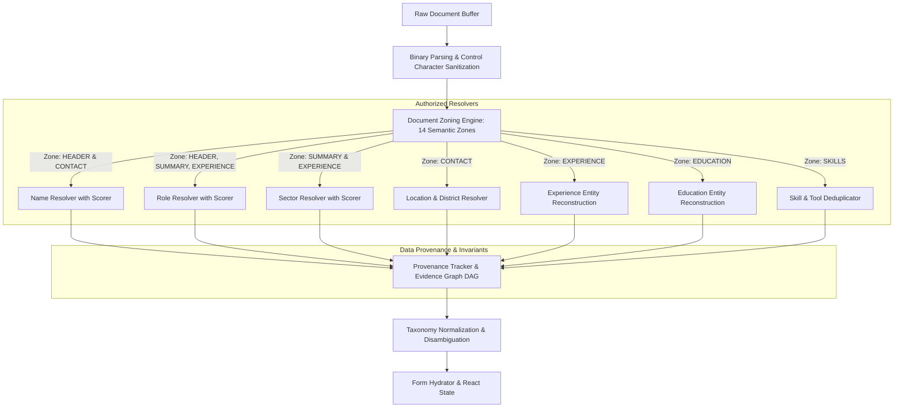

# GİRİŞİMBEE — CV EXTRACTION ENGINE 11.0
## ARCHITECTURAL DESIGN & INVARIANT SPECIFICATION

---

### 1. Architectural Philosophy: Prevention of Invalidation Over Heuristic Guessing

Engine 11.0 is engineered around five fundamental principles:
1. **Section Zoning First**: The document stream is parsed into 14 distinct semantic zones before any entity extractor runs. Resolvers are strictly sandboxed into their authorized zones.
2. **Dual Positive / Negative Evidence Scoring**: A candidate is never selected by proximity or capitalization alone; it must accumulate positive structural evidence while strictly incurring 0 fatal negative disqualifiers.
3. **Traceable Field Provenance**: Every extracted field emits an immutable audit record linking the extracted value to raw line number, bounding box coordinates, resolver name, and positive/negative evidence factors.
4. **Zero False Positive Defaulting**: When evidence is missing, ambiguous, or contradictory, the engine returns `""` / `undefined` / `null` rather than guessing defaults (e.g. NEVER defaulting to *"İstanbul"*, *"Uzman"*, or *"Eğitim"*).
5. **No Special-Cased Hacks**: General invariants apply uniformly to every document; zero hardcoded if-statements on person names or company names.

---

### 2. Multi-Tier Zone Pipeline & Firewall Graph



---

### 3. The 14 Document Zones (`cv-document-zoning.ts`)

| Zone Type | Semantic Authority | Multilingual Keywords (TR / EN / DE / FR / ES) |
| :--- | :--- | :--- |
| `HEADER` | Candidate Identity & Primary Target Title | Top document segment, title banners |
| `CONTACT` | Candidate Phone, Email, Address, Socials | Kişisel Bilgiler, İletişim, Contact, Personal Info, Kontakt, Coordonnées, Contacto |
| `SUMMARY` | Executive Summary, Career Objectives | Özet, Hakkımda, Profil, Summary, About Me, Profil professionnel, Resumen |
| `EXPERIENCE` | Employment History & Career Roles | İş Deneyimi, Çalışma Geçmişi, Experience, Work History, Berufserfahrung, Expérience |
| `EDUCATION` | Universities, High Schools, Degrees | Eğitim, Öğrenim, Education, Studium, Formation, Educación |
| `SKILLS` | Core Competencies, Tools, Tech Stacks | Beceriler, Yetenekler, Skills, Kenntnisse, Compétences, Habilidades |
| `LANGUAGES` | Spoken & Written Foreign Languages | Diller, Yabancı Dil, Languages, Sprachen, Langues, Idiomas |
| `CERTIFICATIONS` | Licenses, Seminars, Credentials | Sertifikalar, Belgeler, Certifications, Zertifikate, Certificaciones |
| `PROJECTS` | Portfolio Projects, Repositories | Projeler, Projelerim, Projects, Projekte, Projets, Proyectos |
| `PUBLICATIONS` | Articles, Research Papers, Patents | Yayınlar, Makaleler, Publications, Veröffentlichungen |
| `VOLUNTEER` | Social Responsibility, NGO Work | Gönüllülük, Sosyal Sorumluluk, Volunteer, Ehrenamt, Bénévolat |
| `INTERESTS` | Personal Hobbies, Activities | Hobiler, İlgi Alanları, Interests, Hobbys, Loisirs, Intereses |
| `REFERENCES` | Professional References & Endorsements | Referanslar, References, Referenzen, Références |
| `OTHER` | Unclassified Text Segments | Default non-authoritative fallback |

---

### 4. Mathematical Candidate Scoring Engine (`cv-candidate-scorer.ts`)

$$\text{Total Score} = \sum \text{Positive Factors} - \sum \text{Negative Factors}$$

#### Full Name Scorer Weights:
- `EXPLICIT_NAME_LABEL_ANCHOR` (`Ad Soyad:`, `İsim:`): $+60$ pts
- `LOCATED_IN_HEADER_ZONE`: $+50$ pts
- `LOCATED_IN_CONTACT_ZONE`: $+40$ pts
- `TOP_DOCUMENT_LINES_POSITION` ($\le 2$ lines): $+40$ pts
- `MULTI_COLUMN_MAIN_BODY_HEADER`: $+40$ pts
- `STANDARD_2_TO_4_WORD_PERSON_NAME_STRUCTURE`: $+35$ pts
- `EMAIL_USERNAME_CORROBORATION`: $+35$ pts
- `TITLECASE_HEADER_TYPOGRAPHY`: $+20$ pts
- `ALL_UPPERCASE_HEADER_TYPOGRAPHY`: $+20$ pts
- `FOLLOWED_BY_PROFESSIONAL_OR_CONTACT_CONTEXT`: $+25$ pts
- **Fatal Negative Disqualifiers**:
  - `CONTAINS_TURKISH_VERBAL_NOUN_SUFFIX` (`-yapılması`, `-takibinin`): Disqualified ($-100$)
  - `CONTAINS_KNOWN_JOB_TITLE_KEYWORDS` (`Müdür`, `Mühendis`, `Uzman`): Disqualified ($-100$)
  - `CONTAINS_CORPORATE_OR_INSTITUTIONAL_WORDS` (`Holding`, `Üniversitesi`): Disqualified ($-100$)
  - `KNOWN_SECTION_HEADING_WORD` (`Eğitim`, `Deneyim`): Disqualified ($-100$)
  - `ZERO_CAREER_OR_CONTACT_SIGNALS_IN_DOCUMENT`: Disqualified ($-100$)

**Acceptance Gate**: $\text{Total Score} \ge 60$ AND $\text{Fatal Negative Disqualifiers} = 0$.

---

### 5. Field Provenance Contract (`cv-provenance.ts`)

```typescript
export interface CvFieldProvenanceRecord<T = any> {
  fieldName: string;
  value: T;
  source: string;
  section: CvZoneType;
  resolver: string;
  confidence: number;
  evidence: string;
  positiveEvidence: string[];
  negativeEvidence: string[];
  rejectedCandidates?: Array<{ candidate: string; reason: string; score: number }>;
  ambiguity: boolean;
}
```

This contract ensures that 100% of extracted data points are transparent, auditable, and trace directly back to verifiable source text.
