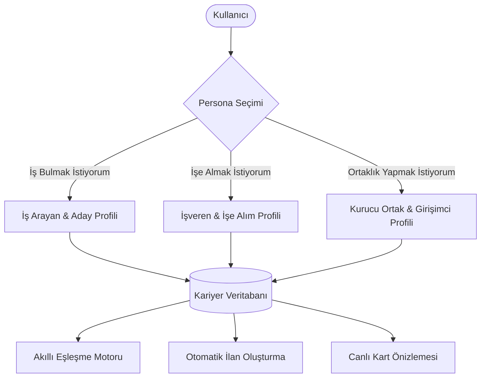

# GİRİŞİMBEE — KARİYER PROFİLİ & EŞLEŞME SİSTEMİ MİMARİ DOKÜMANI

> **Doküman Amacı:** Bu doküman, Girişimbee platformunun Kariyer Profili, İlan Kartı Entegrasyonu, Taksonomi Hiyerarşisi, Eşleşme Motoru (Matching Engine) ve Gizlilik mimarisini ChatGPT veya benzeri yapay zeka modellerinde analiz ettirmek, değerlendirmek veya geliştirmek amacıyla hazırlanmış teknik ve ürün spesifikasyonudur.

---

## 1. ÜRÜN VİZYONU & TEMEL İLKELER

Girişimbee, klasik iş arama ve kariyer sitelerinden farklı olarak **"Neredeyse 0 Manuel Giriş"**, **"Anonim ve Güvenli Eşleşme"** ve **"Deterministik Akıllı Taksonomi"** temelleri üzerine kurulmuştur.

### Temel Prensipler:
1. **Anonimlik ve PII Güvenliği:** İş arayan adayların ad-soyadları maskelenir, iletişim bilgileri (telefon, e-posta) kamuya açık ilan kartlarında asla yer almaz. Şirket isimleri gizli tutulabilir. İletişim sadece çift taraflı onaylanan "İletişim Talebi" (Contact Request) ile açılır.
2. **Kademeli / Bağımlı Seçim (Cascading Taxonomy):** Kullanıcı sektör seçtiğinde sadece ilgili sektörün meslekleri, pozisyon seçtiğinde seviyeye uygun yetkinlikler ve araçlar dinamik olarak listelenir.
3. **Tek Sefer Giriş, Çoklu Kullanım:** Kullanıcı `/dashboard/kariyer-profilim` üzerinden bir kez profil doldurduğunda, yeni ilan oluştururken (`/ilan/olustur`) tüm veriler otomatik aktarılır.
4. **Deterministik Veri Önceliği + Akıllı AI Desteği:** Sistem öncelikle yapısal veriyi (multi-enum, select) kullanır. AI sadece kullanıcının kısa açıklamalarından profesyonel kariyer özeti sentezlemek ve manuel unvanları taksonomiye bağlamak için optimize edilmiş minimum token ile çalışır.

---

## 2. PERSONA MİMARİSİ (3 AYRI ROL)

Sistem tek bir çatı altında 3 farklı kariyer personasını destekler:



### 1. İş Arayan & Aday Profili (`seek`)
- **Hedef:** Kariyer hedefi, uzmanlık alanı, yetkinlikleri ve iş geçmişi ile ilanlarla eşleşmek.
- **Öne Çıkan Alanlar:** Hedef rol(ler), uzmanlık sektörü, kariyer seviyesi, deneyim geçmişi (şirket gizli), teknik/profesyonel yetkinlikler, araçlar, eğitim, diller, sertifikalar, lokasyon ve maaş beklentisi.

### 2. İşveren & İşe Alım Profili (`hire`)
- **Hedef:** Açık pozisyon için aranan kriterleri, temel sorumlulukları ve başarı beklentilerini belirlemek.
- **Öne Çıkan Alanlar:** Pozisyon unvanı, sektör, aranan seviye, temel sorumluluklar, başarı beklentisi (KPI), aranan yetkinlikler, çalışma modeli, opsiyonel şirket adı ve ücret aralığı.

### 3. Kurucu Ortak & Girişimcilik Profili (`partner`)
- **Hedef:** Girişim projesi için ortak aramak veya bir girişime uzmanlık/sermaye ile ortak olmak.
- **Öne Çıkan Alanlar:** Ortaklık türü, girişim aşaması, iş modeli, sermaye katkısı, teklif edilen pay (equity), aranan/sunulan yetkinlikler ve vizyon özeti.

---

## 3. VERİ MODELİ & ALAN SÖZLÜĞÜ (DATA CONTRACT)

Profilde toplanan ve ilan kartına aktarılan tüm alanların teknik dökümü:

| Alan Anahtarı (`Key`) | Veri Tipi | Persona Uyumu | Açıklama |
|---|---|---|---|
| `desiredRole` | `string (enum)` | Seek / Hire / Partner | Birincil hedef pozisyon (Türkçe Title Case, örn: "Kıdemli Yazılım Geliştirici") |
| `preferredRoles` | `string[] (multi-enum)` | Seek | Açık olunan alternatif pozisyonlar listesi |
| `primarySector` | `string (enum)` | Seek / Hire / Partner | Birincil uzmanlık sektörü (örn: "Bilişim / Yazılım") |
| `preferredSectors` | `string[] (multi-enum)` | Seek | İlgilenilen yan sektörler listesi |
| `experienceLevel` | `string (enum)` | Seek / Hire / Partner | Deneyim seviyesi (Stajyer, Başlangıç, 1-3 yıl, 3-5 yıl, 5+ yıl, Yönetici vb.) |
| `experiences` | `Array<CareerExperience>` | Seek | Detaylı iş geçmişi (Sektör, Rol, Yıl, Sorumluluklar, Başarılar) |
| `professionalSkills` | `string (comma-separated)` | Seek / Hire / Partner | Mesleki yetkinlikler (örn: "Problem Çözme, Ekip Yönetimi") |
| `technicalSkills` | `string (comma-separated)` | Seek / Hire / Partner | Teknik yetkinlikler (örn: "TypeScript, PostgreSQL, Docker") |
| `tools` | `string (comma-separated)` | Seek / Hire / Partner | Kullanılan araç ve yazılımlar (örn: "Figma, Jira, Git") |
| `workType` | `string (enum)` | Seek / Hire / Partner | Çalışma tercihi ("Tam zamanlı", "Yarı zamanlı", "Proje bazlı", "Staj") |
| `workplacePreference` | `string (enum)` | Seek / Hire / Partner | Çalışma modeli ("Uzaktan (Remote)", "Hibrit", "Ofiste / Yerinde") |
| `preferredCity` | `string` | Seek / Hire / Partner | Tercih edilen çalışma ili (Varsayılan: "İstanbul") |
| `preferredDistrict` | `string` | Seek / Hire | Tercih edilen ilçe |
| `residenceCity` | `string` | Seek | İkamet edilen il |
| `residenceDistrict` | `string` | Seek | İkamet edilen ilçe |
| `profileGender` | `string (enum)` | Seek | Cinsiyet ("Belirtmek İstemiyorum", "Kadın", "Erkek") |
| `birthDate` | `string (YYYY-MM-DD)` | Seek | Doğum tarihi (Kartta sadece yaş olarak gösterilir) |
| `educationLevel` | `string (enum)` | Seek / Hire | Eğitim durumu ("Lisans", "Yüksek Lisans", "Ön Lisans" vb.) |
| `educationField` | `string` | Seek / Hire | Mezun olunan bölüm / alan |
| `languages` | `string` | Seek / Hire | Yabancı dil ve seviyeleri (örn: "İngilizce — İleri Düzey") |
| `certificates` | `string` | Seek / Hire | Alınan sertifikalar ve lisanslar |
| `availability` | `string (enum)` | Seek / Hire | İşe başlama durumu ("Hemen", "1 ay içinde", "2 hafta içinde" vb.) |
| `salaryMin` / `salaryMax` | `number` | Seek / Hire | Maaş beklentisi / bütçesi (TL) |
| `salaryExpectation` | `string (enum)` | Seek / Hire | Maaş bandı (örn: "50.000 - 75.000 TL", "100.000 TL ve üzeri") |
| `candidateTraits` | `string (text)` | Seek / Hire | İş arayanda: Kariyer Özeti; İşverende: Temel Sorumluluklar |
| `requiredAchievements` | `string (text)` | Hire | İşverenin adayın sağlamasını beklediği KPI / Başarılar |
| `companyName` | `string` | Hire | İşveren firma adı (Opsiyonel) |
| `partnerType` / `stage` | `string` | Partner | Ortaklık rolü, aşaması ve sermaye bilgileri |

---

## 4. TAKSONOMİ VE BAĞIMLILIK HİYERARŞİSİ

```
[Uzmanlık Sektörü]
       │
       ▼ (Dinamik Filtre)
[Meslek / Pozisyon Grubu]
       │
       ├─────────────────────────┬─────────────────────────┐
       ▼                         ▼                         ▼
[Seviyeye Göre           [Teknik Beceriler        [Sorumluluk ve
 Yetkinlik Seti]          & Araçlar]               Başarı Setleri]
```

1. **Evrensel Title Case:** Tüm meslek, sektör, beceri ve açılır kutu elemanları Türkçe başlık düzeninde (`Çağrı Merkezi Satış Müdürü`, `Yazılım Geliştirici`) sunulur.
2. **Akıllı Öneri ve A-Z Sıralaması:** Pozisyon ve sektör seçimlerinde önce kullanıcının kariyer geçmişiyle **en uyumlu seçenekler**, ardından alfabetik liste listelenir.
3. **Manuel Giriş Desteği:** Listede bulunmayan bir unvan veya yetkinlik girildiğinde devreye giren `CareerManualAssist` bileşeni, yazılan metni analiz ederek en yakın taksonomi kümesini eşler.

---

## 5. UI/UX VE KULLANICI AKIŞI

1. **Profil Doldurma (`/dashboard/kariyer-profilim`):**
   - 6 Adımlı Form Yapısı: Temel Bilgiler → Tercihler → Yetkinlikler → Deneyim Geçmişi → Eğitim/Diller → AI Destekli Kariyer Özeti.
   - Canlı İlerleme Çubuğu: Profil gücünü `%0` ile `%100` arasında gerçek zamanlı hesaplar.
   - Sağ Panelde Canlı Kart Önizlemesi: Kullanıcının girdiği bilgilerin kamuya açık kartta nasıl görüneceğini anlık simüle eder (kart aşırı uzamaz, dengeli hiyerarşide kalır).
   - Profil Silme (Delete Profile): Kullanıcının dilediğinde tüm verilerini onay modalı ile sıfırlayabilmesini sağlar.
2. **İlan Oluşturma Entegrasyonu (`/ilan/olustur`):**
   - Profilde kaydedilen 27+ alanın tamamı yeni ilan formuna otomatik yüklenir.
   - Kullanıcı ilan formunda bir alanı değiştirirse bu değişiklik sadece o ilanı etkiler; ana profil bozulmaz.

---

## 6. EŞLEŞME MOTORU (MATCHING ENGINE) MİMARİSİ

Platform 4 farklı alanda (Kariyer, Ortaklık, Franchise, Dijital & AI) 100 üzerinden skor üreten deterministik eşleşme motorlarına sahiptir.

### Kariyer Eşleşme Ağırlıkları (Scoring Weights):
- **Rol & Pozisyon Uyumu:** %30
- **Sektör Uyumu:** %20
- **Yetkinlik & Beceriler (Skill Overlap):** %20
- **Lokasyon & Çalışma Modeli:** %15
- **Deneyim Seviyesi & Geçmiş:** %10
- **Eğitim & Diller:** %5

> **Eşik Kuralı:** %50'nin altındaki eşleşmeler kullanıcılara listelenmez. %80+ "Çok Güçlü Uyum", %65+ "Güçlü Uyum" rozetleriyle sunulur.

---

## 7. CHATGPT ANALİZ PROMPT ŞABLONU

Aşağıdaki metni ChatGPT'ye ileterek sisteminizi analiz ettirebilirsiniz:

```text
Aşağıda teknik ve ürün mimarisi verilen "Girişimbee Kariyer ve Eşleşme Platformu" dokümanını incele.

Bir Senior Product Manager & Lead UX Architect gözüyle şu başlıklar altında analiz yap:

1. Bilgi Mimarisi & Form UX: "0 Manuel Giriş" hedefi ve 27+ alanlık veri modeli kullanıcı dostu mu? Nerede sürtünme (friction) oluşabilir?
2. Taksonomi & Bağımlılıklar: Sektör -> Rol -> Beceri hiyerarşisi eşleşme kalitesini nasıl artırır? Eksik veya geliştirilebilecek alanlar nelerdir?
3. B2C (Aday) vs B2B (İşveren) Persona Ayrımı: Kartların ve formların iki taraf için de karar verdirici olması açısından güçlü ve zayıf yönleri nelerdir?
4. Monetizasyon & Büyüme Fırsatları: Bu kariyer profili ve eşleşme altyapısı üzerine hangi katma değerli özellikler (premium filtreler, öne çıkarma, AI mülakat simülasyonu vb.) inşa edilebilir?
```
