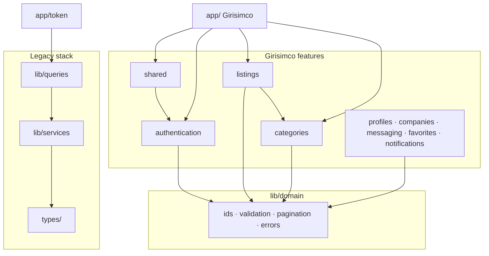

# Girisimco — Architecture Report

**Review date:** Sprint 3 completion  
**Scope:** Full project audit — FDD compliance, dependency health, technical debt  
**Products in repo:** Girisimco (marketplace) + İkinciBazar (legacy price-comparison dashboard)

---

## 1. Executive Summary

| Area | Status | Notes |
|------|--------|-------|
| Feature-Driven Design (Girisimco) | **Partial** | Domain layer complete; UI still in `components/girisimco/` |
| Circular dependencies | **Pass** | madge: 392 files, 0 cycles |
| TypeScript build | **Pass** | `tsc --noEmit` clean |
| Duplicate services | **Resolved (naming)** | `listingViewService` vs `listingService` (marketplace) |
| Duplicate types | **Resolved (listing detail)** | Single source in `features/listings/types/` |
| Legacy dashboard FDD | **Not migrated** | `app/[token]/*` uses `lib/queries` directly |

---

## 2. Folder Structure

```
project/
├── app/                          # Route composers (thin)
│   ├── page.tsx                  # Girisimco homepage
│   ├── giris/ kayit/ sifre-*/    # Auth routes → features/authentication
│   ├── dashboard/                # Protected user panel
│   ├── ilan/[id]/ ilan/olustur/  # Listing routes → features/listings
│   ├── auth/callback/ signout/   # Supabase auth handlers
│   └── [token]/                  # İkinciBazar legacy dashboard (separate product)
│
├── features/                     # FDD domain ownership (130 files)
│   ├── index.ts                  # Architecture rules + namespace exports
│   ├── shared/                   # Cross-cutting: config, nav, premium, moderation domain
│   ├── authentication/           # Supabase Auth, RBAC, forms, session
│   ├── categories/               # Intent gateway + Category entity
│   ├── listings/                 # Listing Engine, forms, entities, mock views
│   ├── companies/ profiles/      # Domain scaffolds (types, repos, validation)
│   ├── messaging/ favorites/ notifications/
│   ├── dashboard/ search/        # Stubs (types only)
│
├── lib/
│   ├── domain/                   # Shared kernel (ids, validation, pagination, seed)
│   ├── supabase/                 # SSR auth clients (client, server, middleware)
│   ├── supabase.ts               # Legacy singleton (İkinciBazar data, no session)
│   ├── girisimco/                # Deprecated shims → re-export features/*
│   ├── services/                 # İkinciBazar Supabase CRUD
│   ├── queries.ts                # Legacy React Query layer (600+ lines)
│   └── engines/ stores/          # AI, pricing, bundle detection
│
├── components/
│   ├── ui/                       # shadcn primitives (allowed by FDD)
│   ├── girisimco/                # Girisimco UI (pending physical move to features/)
│   ├── listing-detail/           # İkinciBazar listing UI
│   └── providers/                # AppProviders (Query, Theme, Auth)
│
├── hooks/                        # Legacy root hooks (İkinciBazar)
├── types/                        # Legacy DTOs (İkinciBazar)
├── services/                     # Scrapers / sync runners
└── supabase/migrations/          # DB: auth profiles + marketplace + scraper schema
```

---

## 3. Feature Dependencies



### Import rules (FDD)

| From | May import | Must NOT import |
|------|-----------|-----------------|
| `app/` | `@/features/*`, `@/components/ui/*` | `@/lib/girisimco/*`, deep feature paths |
| `features/X` | `@/lib/domain`, `@/features/shared`, same-feature internals | Other features' internals (use barrel) |
| `components/ui` | Utilities only | Feature business logic |
| `lib/domain` | Self only | `features/*` (except seed — see debt) |

### Current violations

| Severity | Issue | Location |
|----------|-------|----------|
| Medium | Girisimco UI not under `features/*/components/` | `components/girisimco/` (22 files) |
| Medium | Legacy dashboard bypasses features | `app/[token]/*` → `lib/queries`, `hooks/` |
| Medium | Business logic in route composer | `app/ilan/olustur/page.tsx` orchestrates create+publish |
| Low | `lib/domain/seed.ts` imports all feature mocks | Latent cycle risk if mocks import domain barrel |

---

## 4. Shared Modules

| Module | Purpose | Consumers |
|--------|---------|-----------|
| `lib/domain/` | Branded IDs, Zod primitives, pagination, lifecycle helpers | All features |
| `lib/supabase/` | Cookie-based auth (SSR) | authentication, middleware |
| `lib/supabase.ts` | Anon client, no session | İkinciBazar services |
| `features/shared/` | Nav, premium gates, Report/Activity/Subscription domain | All Girisimco pages |
| `components/ui/` | shadcn design system | All UI |

---

## 5. Audit Results (10-Point Checklist)

### 1. Duplicated components
**Status: Medium debt**

- Girisimco listing UI vs İkinciBazar listing UI are **different products** (not duplicates).
- `ListingHeader` exists in both `components/girisimco/listing/` and `components/listing-detail/` — same name, different domains. **Rename recommended** in Sprint 4: `GirisimcoListingHeader` vs `MarketplaceListingHeader`.

### 2. Duplicated services
**Status: Resolved (naming)**

| Service | Location | Domain |
|---------|----------|--------|
| `listingViewService` | `features/listings/services/listing.service.ts` | Girisimco mock detail |
| `listingService` | `lib/services/listing-service.ts` | İkinciBazar Supabase CRUD |
| `listingEngine` | `features/listings/engine/` | Girisimco lifecycle |

### 3. Duplicated validation
**Status: Acceptable split**

- **Entity schemas:** `features/*/validation/*.schema.ts` — DB/persistence shape
- **Form schemas:** `features/listings/form/build-dynamic-schema.ts` — runtime config-driven
- **Auth forms:** `auth.schema.ts` (register/reset) + `user.schema.ts` (login/domain user)

Intentional separation; no merge needed.

### 4. Duplicated TypeScript interfaces
**Status: Resolved / documented**

| Name | Girisimco | Legacy (`types/`) |
|------|-----------|-------------------|
| `Listing` | Domain entity (`listing.entity.types.ts`) | Scraped product row |
| `ListingDetail` | UI view model (`listing.types.ts`) | N/A |
| `ListingSummary` | Card item | Aggregate stats |
| `UserRole` | Auth RBAC (`auth.types.ts`) | — |
| `DomainUserRole` | Domain user entity (`user.types.ts`) | — |
| `Category` | Domain entity | Product category DTO |
| `CategoryIntent` | UI intent gateway | — |

### 5. Circular dependencies
**Status: Pass**

```
madge --circular: 392 files processed, 0 circular dependencies
```

### 6. Unused code
**Status: Partial cleanup done**

Removed: `lib/girisimco/constants.ts`, `lib/girisimco/features.ts` (zero imports).

Remaining candidates (do not delete without product confirmation):
- `lib/mock-data.ts`, `lib/mock-data-v2.ts` — legacy compatibility, no active imports found
- `lib/domain/seed.ts` — orchestrator never called in runtime
- `ContentCardCompact` export — unused

### 7. Dead files
**Status: Shims retained for backward compat**

| File | Status |
|------|--------|
| `lib/girisimco/listings.ts` | Deprecated shim → `features/listings/mock/` |
| `lib/girisimco/intent.ts` | Deprecated shim → `features/categories/mock/` |

### 8. Naming consistency
**Status: Improved this review**

Changes applied:
- `listingViewService` — Girisimco mock reader
- `DomainUserRole` — domain user entity (vs auth `UserRole`)
- `ListingSearchFilter` — UI filter (was conflicting `ListingFilter`)

Remaining inconsistencies:
- Turkish routes (`/ilan/`) vs English (`/[token]/listings/`)
- `hooks/` at root vs `features/*/hooks/`

### 9. Broken imports
**Status: Pass** — `tsc --noEmit` clean after all changes.

### 10. Architecture violations
**Status: Partial**

Girisimco routes follow FDD. İkinciBazar dashboard is intentionally separate until unified or extracted.

---

## 6. Feature Module Inventory

| Feature | Types | Validation | Repos | Services | UI | Status |
|---------|-------|------------|-------|----------|-----|--------|
| authentication | ✅ | ✅ | ✅ iface | ✅ Supabase | ✅ | **Production** |
| categories | ✅ | ✅ | ✅ iface | Mock | Via shim | Domain ready |
| listings | ✅ | ✅ | ✅ iface | ✅ Engine | Via shim | **Sprint 3 complete** |
| shared | ✅ | ✅ | ✅ iface | ✅ iface | Via shim | Cross-cutting |
| companies | ✅ | ✅ | ✅ iface | ✅ iface | — | Scaffold |
| profiles | ✅ | ✅ | ✅ iface | ✅ iface | — | Scaffold |
| messaging | ✅ | ✅ | ✅ iface | ✅ iface | — | Scaffold |
| favorites | ✅ | ✅ | ✅ iface | ✅ iface | — | Scaffold |
| notifications | ✅ | ✅ | ✅ iface | ✅ iface | — | Scaffold |
| dashboard | Stub | — | — | — | — | Sprint 4 |
| search | Stub | — | — | — | — | Sprint 4 |

---

## 7. Technical Debt (Prioritized)

### P0 — Before Sprint 4
1. **Physical UI migration:** Move `components/girisimco/` → `features/*/components/`
2. **Supabase listing persistence:** Implement `ListingRepository` against `marketplace_listings` migration
3. **Wire listing engine to DB:** Replace in-memory `listingStore` in production

### P1 — Sprint 4–5
4. **Dashboard feature module:** User listings, applications, messages
5. **Extract create-listing orchestration** from `app/ilan/olustur/page.tsx` → `useCreateListing` hook
6. **Intent ↔ Category bridge:** Map `CategoryIntentId` to `CategoryId` in registry (partial — `resolveCategoryId` exists)
7. **Remove deprecated shims:** Delete `lib/girisimco/` after confirming zero imports

### P2 — Future
8. **İkinciBazar isolation:** Extract to `features/marketplace/` or separate package
9. **Unify or namespace legacy `types/index.ts`** (3000+ lines)
10. **Delete `lib/mock-data*.ts`** after legacy dashboard deprecation
11. **Rename colliding components** (`ListingHeader`, etc.)

---

## 8. Scalability Concerns

| Concern | Current state | Recommendation |
|---------|---------------|----------------|
| Listing search at scale | In-memory filter | PostgreSQL GIN indexes defined in entity types; implement full-text search |
| Dynamic fields | JSONB `custom_fields` | Already designed; migration exists |
| Auth sessions | Supabase SSR + middleware | Production-ready |
| Activity feed | In-memory append | Move to append-only `activities` table with partial index on `is_public` |
| File uploads | URL strings in form | S3/Supabase Storage + `AttachmentService` implementation |
| Multi-tenant RLS | Marketplace migration has owner-scoped policies | Apply migration, test RLS |
| Caching | React Query 30s stale | Add CDN for public listings, cursor pagination for feeds |

---

## 9. Dependency Audit Summary

```
Tool: madge v6+
Files analyzed: 392
Circular dependencies: 0
TypeScript errors: 0
Build: pass
```

### Key dependency flows (Girisimco)

```
app/page.tsx
  → features/shared (SiteHeader, SiteFooter)
  → features/categories (IntentGateway → components/girisimco/platform-home)

app/ilan/[id]/page.tsx
  → features/listings (getListingById, ListingDetailPage)

app/ilan/olustur/page.tsx
  → features/listings (DynamicListingForm, useListingEngine, categoryRegistry)

middleware.ts
  → lib/supabase/middleware
  → features/authentication (routes, roles, fetchProfile)
```

---

## 10. Changes Applied in This Review

Code quality fixes only — no UI changes, no new features:

1. Migrated mock data: `lib/girisimco/listings.ts` → `features/listings/mock/listing-detail.mock.ts`
2. Migrated intent data: `lib/girisimco/intent.ts` → `features/categories/mock/intents.data.ts`
3. Renamed `listingService` → `listingViewService` in features (deprecated alias kept)
4. Renamed domain `UserRole` → `DomainUserRole` to avoid auth collision
5. Removed dead shims: `lib/girisimco/constants.ts`, `lib/girisimco/features.ts`
6. Fixed FDD import in `app/ilan/olustur/page.tsx` (barrel imports only)
7. Deprecated re-export shims retained at `lib/girisimco/` for backward compatibility

---

## 11. Sprint 4 Readiness

**Ready to proceed** with:
- User dashboard (listings owned, drafts, published)
- Messaging module (interfaces exist)
- Supabase repository implementations
- Physical UI migration under features

**Blockers:** None architectural. Migration `20260729010000_create_marketplace_listing_engine.sql` should be applied before DB-backed listings.

---

*Generated as part of Sprint 3 architecture review. Update this document when physical UI migration or İkinciBazar separation occurs.*
